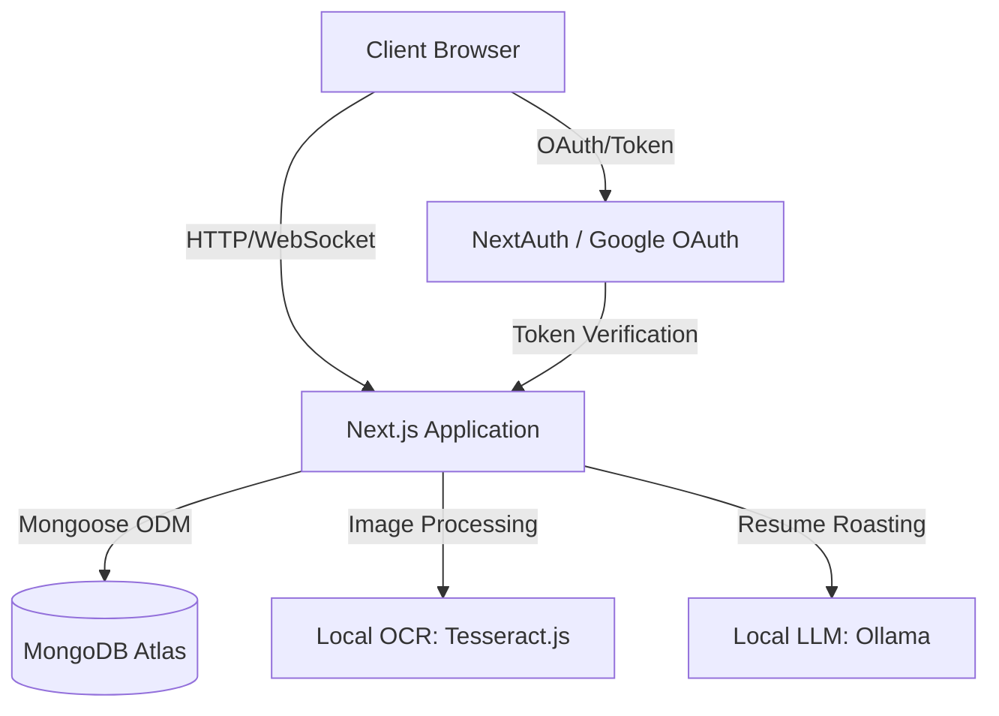

# collegeConnect: Academic Networking and Proof of Work Platform

collegeConnect is a scalable, Next.js based platform engineered for academic networking, portfolio verification, and hyper-local community management. The system leverages fully-local AI-driven KYC (Know Your Customer) processes to verify student identities securely without API keys, and isolates user bases into verified, college specific networks.

## System Architecture

The application follows a modern serverless architecture pattern, utilizing Next.js App Router for server side rendering and API route handling, backed by a MongoDB cluster. AI processing has been refactored to be API-free using local execution.



## Technology Stack

| Component | Technology | Purpose |
| :--- | :--- | :--- |
| Framework | Next.js 16 (App Router) | Server-side rendering, routing, API endpoints |
| Language | TypeScript | Static typing, interface definitions |
| Database | MongoDB & Mongoose | Document storage, schema validation |
| Authentication | NextAuth (Google OAuth) | Secure session management & OAuth |
| Styling | CSS Modules | Scoped component styling, custom design system |
| OCR AI | Tesseract.js | Client-compressed, server-side OCR for ID verification |
| Generative AI | Ollama (llama3.2) | Local API-free AI model for roasting resumes |

## Core Modules

### 1. Identity and Verification Pipeline
The verification system ensures a high trust environment by algorithmically confirming student enrollment securely without third-party APIs.
* Users upload institutional ID cards which are compressed client-side via HTML5 Canvas.
* Images are processed instantly on the server via a cached tesseract.js worker.
* Extracted text is cross-referenced against user profile data (Name, College).
* Successful validation modifies the user schema verified boolean, unlocking protected application tiers.

### 2. Community Routing System
Users are dynamically partitioned into micro-communities based on their institutional affiliation.
* Centralized dataset of 200+ Indian academic institutions.
* Dedicated database indexing on the college field for O(1) query performance on community feeds.
* Segregated project boards and discussion forums per institution.

### 3. Proof of Work (PoW) Infrastructure
The platform replaces conventional resumes with a verifiable project portfolio.
* Users log technical projects and deployments.
* Peer endorsement system validates technical claims.
* AI driven resume analysis module parses and critiques uploaded PDFs using local ollama endpoints.

## Directory Structure

```text
collegeConnect/
  ├── public/              # Static assets and images
  ├── src/
  │   ├── app/             # Next.js App Router directory
  │   │   ├── api/         # Serverless API endpoints
  │   │   ├── community/   # College specific community feeds
  │   │   ├── profile/     # User profile management and verification
  │   │   └── roast/       # AI resume analysis module
  │   ├── components/      # Reusable React components (Navbar, Modals)
  │   ├── data/            # Static datasets (Colleges, States)
  │   ├── lib/             # Utility functions and database connectors
  │   └── models/          # Mongoose schema definitions
  ├── .env.local           # Environment configuration (git ignored)
  ├── next.config.ts       # Framework configuration
  └── package.json         # Dependency management
```

## Environment Configuration

Create a .env.local file in the project root with the following keys.

| Variable Name | Required | Description |
| :--- | :--- | :--- |
| NEXTAUTH_SECRET | Yes | Secret key for signing NextAuth sessions |
| GOOGLE_CLIENT_ID | Yes | Google Cloud OAuth Client ID |
| GOOGLE_CLIENT_SECRET | Yes | Google Cloud OAuth Client Secret |
| MONGODB_URI | Yes | Connection string for MongoDB instance |
| OLLAMA_BASE_URL | No | (Optional) URL to your hosted Ollama instance for production |

## Installation and Build Pipeline

1. Clone the repository and install dependencies.
```bash
git clone https://github.com/tanushbhootra576/collegeConnect.git
cd collegeConnect
npm install
```

2. Start your local Ollama instance (required for Resume Roast to function locally).
```bash
ollama run llama3.2
```

3. Initialize the development server.
```bash
npm run dev
```

4. Execute the production build process.
```bash
npm run build
npm start
```

## Deployment Notes

This repository is optimized for deployment via Vercel. Ensure all environment variables listed in the configuration table are mapped exactly within the Vercel project settings prior to triggering a build. The default Next.js build command (npm run build) is automatically detected.

Note on Live Deployments (Ollama & Tesseract):
* Tesseract.js is configured to write to os.tmpdir() to respect Vercel's read-only filesystem. ID Verification will work out of the box in production.
* Ollama Resume Roasting requires a live, hosted Ollama endpoint (e.g. EC2, Railway, or external GPU service) when deployed to Vercel, since Vercel cannot hit your localhost Ollama. Set an OLLAMA_BASE_URL environment variable pointing to your hosted model for it to work in production.

Developed by Tanush Bhootra.
